# Binary Signer & Verifier

## Overview

This project provides a toolset for hashing a binary file with the BLAKE2 hashing algorithm and signing it using a provided private key. The signed hash can be verified later using the corresponding public key. Additionally, the system incorporates a hardware identifier (HID) to ensure that the signature is specific to both the software and the hardware it runs on.

## Features

- **Hashing**: Uses the BLAKE2 hashing algorithm to create a hash of the binary file.
- **Signing**: Signs the hash with a given private key.
- **Hardware Binding**: Incorporates a hardware identifier (HID) into the hash to bind the software to specific hardware.
- **Verification**: Verifies the signed hash using the corresponding public key.

## Process Description

The process of signing and verifying a binary file in this project involves several steps to ensure the integrity and authenticity of the software, as well as its binding to specific hardware. Below is a short description of the process followed by a Mermaid diagram illustrating the hashing and signing workflow.
### Hashing and Signing Process

- Input Reading: The process starts by reading the private key, binary file, and hardware identifier (HID) file.
- Hashing Binary File: The binary file is hashed using the BLAKE2 hashing algorithm to generate a hash of the software.
- Hashing HID: The hardware identifier (HID) is also hashed using the BLAKE2 hashing algorithm.
- Concatenation and Final Hash: The hash of the binary file and the hash of the HID are concatenated and hashed again to produce a final combined hash.
- Signing: This final hash is signed using the provided private key, creating a digital signature.
- Output: The final hash (encoded in Base64) and the signature are saved to files.

### Verification Process

- Input Reading: The process starts by reading the public key, binary file, signature file, and hardware identifier (HID) file.
- Hashing Binary File: The binary file is hashed using the BLAKE2 hashing algorithm to generate a hash of the software.
- Hashing HID: The hardware identifier (HID) is also hashed using the BLAKE2 hashing algorithm.
- Concatenation and Final Hash: The hash of the binary file and the hash of the HID are concatenated and hashed again to produce a final combined hash.
- Verification: The digital signature is verified against the final hash using the provided public key.
- Output: The verification result is displayed, indicating whether the signature is valid or not.

```mermaid
graph TD
    A[Start Signing] --> B[Read Private Key]
    B --> C[Read Binary File]
    C --> D[Read HID File]
    D --> E[Hash Binary File with BLAKE2]
    E --> F[Hash HID with BLAKE2]
    F --> G[Concatenate Binary Hash and HID Hash]
    G --> H[Hash Concatenated Hash with BLAKE2]
    H --> I[Sign Final Hash with Private Key]
    I --> J[Save Base64 Encoded Hash and Signature to Files]
    J --> K[End Signing]

    L[Start Verifying] --> M[Read Public Key]
    M --> N[Read Binary File]
    N --> O[Read Signature File]
    O --> P[Read HID File]
    P --> Q[Hash Binary File with BLAKE2]
    Q --> R[Hash HID with BLAKE2]
    R --> S[Concatenate Binary Hash and HID Hash]
    S --> T[Hash Concatenated Hash with BLAKE2]
    T --> U[Verify Signature with Public Key]
    U --> V{Is Signature Valid?}
    V -->|Yes| W[Verification Successful]
    V -->|No| X[Verification Failed]

    subgraph Signing Process
        A --> B
        B --> C
        C --> D
        D --> E
        E --> F
        F --> G
        G --> H
        H --> I
        I --> J
        J --> K
    end

    subgraph Verifying Process
        L --> M
        M --> N
        N --> O
        O --> P
        P --> Q
        Q --> R
        R --> S
        S --> T
        T --> U
        U --> V
        V --> W
        V --> X
    end

```




## Usage

### Sign a Binary File

```sh
sign <path_to_private_key> <path_to_binary_file> <HID>
```

### Verify a Signed Binary File
```sh
verify <path_to_public_key> <path_to_binary_file> <path_to_signature_file> <HID>
```

## Why Use This Tool for Licensing Embedded Software?

Licensing embedded software can be challenging due to the need to ensure that the software runs only on specific hardware and remains unaltered. This tool provides a robust solution by combining software hashing with a hardware identifier (HID), creating a unique signature that ties the software to the hardware. This ensures that the licensed software cannot be easily copied or tampered with, enhancing security and control over the distribution of the software.

### Strengths
- Security: Uses BLAKE2, a cryptographic hashing algorithm, and digital signatures to ensure data integrity and authenticity.
- Hardware Binding: The incorporation of a hardware identifier (HID) ensures that the software can only run on the intended hardware, adding an extra layer of security. 
- Ease of Use: Simple command-line interface for signing and verifying binary files.

### Weaknesses

- Dependency on Hardware Identifier: The system relies on the presence and integrity of the hardware identifier (HID) file. If the HID is compromised or not unique enough, the security benefits may be reduced.
- Key Management: Securely managing and protecting private keys is crucial. If the private key is compromised, the entire system's security is at risk.
- Complexity in Setup: Initial setup and understanding of the system might be complex for users not familiar with cryptographic concepts.

## Conclusion

This project offers a comprehensive solution for signing and verifying binary files, making it a valuable tool for licensing embedded software. By combining software and hardware security measures, it ensures that the software runs only on the intended devices, providing enhanced control and protection against unauthorized use and tampering.
License

This project is licensed under the GPLv3 License. See the [LICENSE](LICENSE) file for more details.