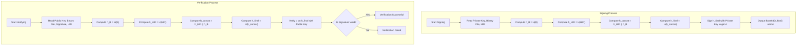

# Binary Signer & Verifier

## Disclaimer

This code is a **Proof of Concept** and should not be used in production systems.

## Table of Contents

- [Overview](#overview)
- [Features](#features)
- [Requirements](#requirements)
- [Cryptographic Scheme and Security Proof](#cryptographic-scheme-and-security-proof)
  - [Definitions](#definitions)
  - [Scheme Description](#scheme-description)
  - [Security Analysis](#security-analysis)
  - [Proof of Security](#proof-of-security)
- [Process Description](#process-description)
  - [Hashing and Signing Process](#hashing-and-signing-process)
  - [Verification Process](#verification-process)
- [Usage](#usage)
  - [Sign a Binary File](#sign-a-binary-file)
  - [Verify a Signed Binary File](#verify-a-signed-binary-file)
- [Why Use This Tool for Licensing Embedded Software](#why-use-this-tool-for-licensing-embedded-software)
  - [Strengths](#strengths)
  - [Weaknesses](#weaknesses)
- [Conclusion](#conclusion)
- [License](#license)

## Overview

This project provides a toolset for hashing a binary file with the **BLAKE2b** cryptographic hash function and signing it using a provided private key based on the **Ed25519** digital signature algorithm. The signed hash can be verified later using the corresponding public key. Additionally, the system incorporates a hardware identifier (HID) to ensure that the signature is specific to both the software and the hardware it runs on.

## Features

- **Hashing**: Utilizes the BLAKE2b cryptographic hash function to create a secure hash of the binary file.
- **Signing**: Signs the hash with a given Ed25519 private key.
- **Hardware Binding**: Incorporates a hardware identifier (HID) into the hash to bind the software to specific hardware.
- **Verification**: Verifies the signed hash using the corresponding Ed25519 public key.

## Requirements

- **Private Key File**: A PEM-encoded private key file for signing the binary hash.
- **Public Key File**: A PEM-encoded public key file for verifying the binary hash.
- **Binary File**: The binary file you want to hash and sign.
- **Hardware Identifier (HID)**: A unique hardware-specific string.

## Cryptographic Scheme and Security Proof

### Definitions

#### Cryptographic Hash Functions

A cryptographic hash function H is a deterministic function that maps binary strings of arbitrary length to binary strings of fixed length n. It should satisfy:

- Pre-image Resistance: Given a hash h, it is computationally infeasible to find an input x such that H(x) = h.
- Second Pre-image Resistance: Given input x1, it is computationally infeasible to find x2 ≠ x1 such that H(x1) = H(x2).
- Collision Resistance: It is computationally infeasible to find any two distinct inputs x1 ≠ x2 such that H(x1) = H(x2).
    
#### Digital Signatures

A digital signature scheme consists of three algorithms:

- Key Generation (KeyGen): Generates a public-private key pair (pk, sk).
- Signing (Sign): Uses private key sk to produce a signature σ on message m.
- Verification (Verify): Uses public key pk to verify that σ is a valid signature for message m.
A secure digital signature scheme should be **existentially unforgeable under chosen-message attacks (EUF-CMA)**.

### Scheme Description

#### Notation

- Let H denote the BLAKE2b hash function.
- Let Sign_sk and Verify_pk denote the Ed25519 signing and verification algorithms.
- Let || denote concatenation of byte strings.

#### Algorithm Steps

1. **Hash the Binary File**:
```h_B = H(B)```

2. **Hash the Hardware Identifier**:
   ```h_HID = H(HID)```

3. **Concatenate Hashes**:
```h_concat = h_HID || h_B```

4. **Hash the Concatenated Hashes**:
```h_final = H(h_concat)```

5. **Sign the Final Hash**:
```σ = Sign_sk(h_final)```

6. **Output**:
- Base64 encoding of h_final.
- Signature σ.
#### Verification

To verify the signature on a specific hardware device:

1. **Obtain Public Key (\( pk \))**: The verifier must have access to the signer's public key.
2. **Recompute Hashes**:
```h_B = H(B)```
```h_HID = H(HID)```
```h_concat = h_HID || h_B```
```h_final = H(h_concat)```

3. **Verify Signature**:
```Verify_pk(h_final, σ)```

   The signature is valid if and only if this verification succeeds.

### Security Analysis

The security of the scheme relies on two primary cryptographic assumptions:

1. **Collision Resistance of BLAKE2b**:
   - Ensures that an adversary cannot find different inputs producing the same hash output.

2. **Existential Unforgeability of Ed25519**:
   - Prevents forging a valid signature without access to the private key sk.

### Proof of Security

#### Theorem

*Assuming BLAKE2b is collision-resistant and Ed25519 is existentially unforgeable under chosen-message attacks, the proposed scheme is secure against adversaries attempting to forge signatures or alter the binary or hardware identifier without detection.*

#### Proof 
1. Hash Collision Resistance:
    - An adversary cannot find B' or HID' such that h_final' = h_final unless they find a collision in H.
    - Since h_final = H(H(HID) || H(B)), altering B or HID changes h_final.

2. Signature Unforgeability:
    - Without the private key sk, an adversary cannot produce a valid signature σ' on any new h_final'.
    - This is due to the existential unforgeability of Ed25519 under chosen-message attacks.

3. Combined Security:

The combination of hash collision resistance and signature unforgeability ensures that an adversary cannot:  
- Forge a valid signature on a tampered binary or HID.  
- Substitute a different binary or HID without detection.  

4. **Conclusion**:

Under the given cryptographic assumptions, the scheme is secure against forgery and tampering. Only someone with access to the private key sk can produce a valid signature for the specific combination of B and HID.

## Process Description

### Hashing and Signing Process

1. **Input Reading**: Read the private key, binary file, and hardware identifier (HID).
2. **Hashing Binary File**: Use BLAKE2b to hash the binary file, producing h_B.
3. **Hashing HID**: Use BLAKE2b to hash the HID, producing h_HID.
4. **Concatenate and Final Hash**:Hash h_concat using BLAKE2b to produce h_final.
5. **Signing**: h_final with the private key using Ed25519, producing signature σ.
6. **Output**: Save the Base64-encoded h_final and the signature σ to files.

### Verification Process

1. **Input Reading**:Read the public key, binary file, signature file, and HID.
2. **Hashing Binary File**:Use BLAKE2b to hash the binary file, producing h_B.
3. **Hashing HID**:  Use BLAKE2b to hash the HID, producing h_HID.
4. **Concatenate and Final Hash**: Concatenate h_HID and h_B, forming h_concat. Hash h_concat using BLAKE2b to produce h_final.
5. **Verification**: Verify the signature σ against h_final using the public key.
6. **Output**: Display whether the signature is valid.


```mermaid
graph TD
    subgraph Signing Process
        A[Start Signing] --> B[Read Private Key, Binary File, HID]
        B --> C["Compute h_B = H(B)"]
        C --> D["Compute h_HID = H(HID)"]
        D --> E["Compute h_concat = h_HID || h_B"]
        E --> F["Compute h_final = H(h_concat)"]
        F --> G["Sign h_final with Private Key to get σ"]
        G --> H["Output Base64(h_final) and σ"]
    end

    subgraph Verification Process
        I[Start Verifying] --> J[Read Public Key, Binary File, Signature, HID]
        J --> K["Compute h_B = H(B)"]
        K --> L["Compute h_HID = H(HID)"]
        L --> M["Compute h_concat = h_HID || h_B"]
        M --> N["Compute h_final = H(h_concat)"]
        N --> O[Verify σ on h_final with Public Key]
        O --> P{Is Signature Valid?}
        P -->|Yes| Q[Verification Successful]
        P -->|No| R[Verification Failed]
    end
```

## usage

### Sign a Binary File

```sh
sign <path_to_private_key> <path_to_binary_file> <HID>
```

### Verify a Signed Binary File
```sh
verify <path_to_public_key> <path_to_binary_file> <path_to_signature_file> <HID>
```

## Why Use This Tool for Licensing Embedded Software?

Licensing embedded software can be challenging due to the need to ensure that the software runs only on specific hardware and remains unaltered. This tool provides a robust solution by combining software hashing with a hardware identifier (HID), creating a unique signature that ties the software to the hardware. This ensures that the licensed software cannot be easily copied or tampered with, enhancing security and control over the distribution of the software.

## Strengths

- Security: Utilizes strong cryptographic primitives to ensure integrity and authenticity.
- Hardware Binding: Ensures software runs only on designated hardware.
- Efficiency: Suitable for resource-constrained environments like embedded systems.

## Weaknesses

- HID Management: Relies on the uniqueness and secrecy of the HID.
- Key Management: Requires secure storage of private keys.
- Complexity: May introduce complexity in deployment and maintenance.

## Conclusion

This project offers a comprehensive solution for signing and verifying binary files, making it a valuable tool for licensing embedded software. By combining software and hardware security measures, it ensures that the software runs only on the intended devices, providing enhanced control and protection against unauthorized use and tampering.

### License

This project is licensed under the GPLv3 License. See the [LICENSE](LICENSE) file for more details.
